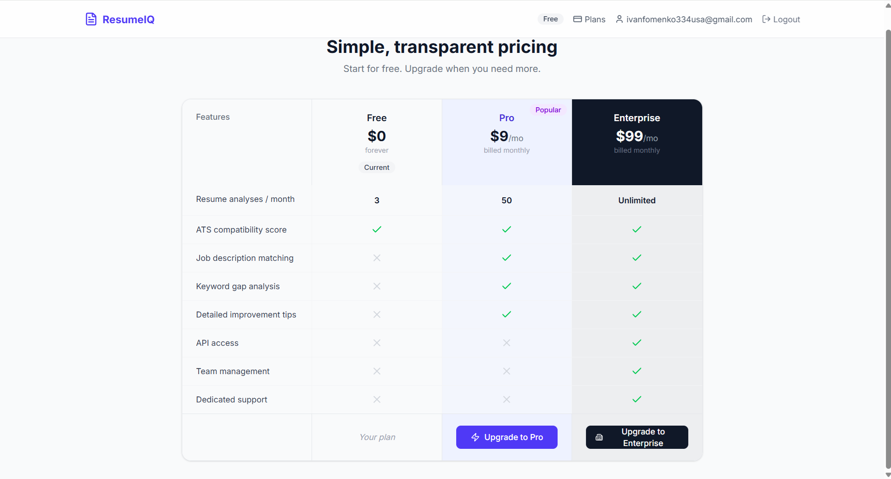
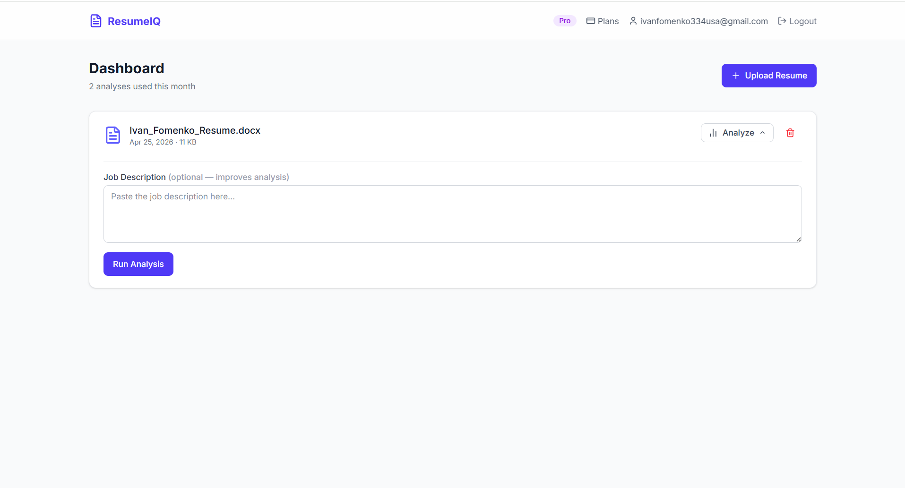

# 📄 ResumeIQ

[](https://resumeiq-jet.vercel.app)
[](LICENSE)
[](https://react.dev)
[](https://fastapi.tiangolo.com)

> AI-powered resume analysis SaaS. Upload your resume, optionally paste a job description, and get instant ATS scoring with actionable improvement feedback powered by OpenAI GPT-4o-mini.

**→ [Try it live: resumeiq-jet.vercel.app](https://resumeiq-jet.vercel.app)**

---

## 📸 Preview

### Resume Analysis & ATS Scoring


### Pricing & Billing Plans


### User Dashboard


<!-- Add more screenshots below — just copy and paste these lines -->
<!-- ### Section Name -->
<!--  -->

---

## ✨ Key Features

- 🤖 **AI-Powered Analysis** — ATS scoring and actionable feedback via OpenAI GPT-4o-mini
- 📊 **Job Description Matching** — Compare resume against a job post, get match % and missing skills
- 💳 **Flexible Billing** — Free / Pro / Enterprise plans via Stripe Checkout + webhooks
- 🔐 **Secure Auth** — Supabase authentication with JWT validation and email confirmation
- 📧 **Transactional Emails** — Welcome, invoice, and confirmation emails via Resend
- ⚡ **Fully Deployed** — Vercel + Railway + Supabase + Resend + Stripe — all in production

---

## 🏗️ Architecture

```
┌─────────────────────┐   HTTPS   ┌──────────────────────┐
│  Vercel (Frontend)  │ ────────► │  Railway (Backend)   │
│  React + Vite       │           │  FastAPI + Python     │
└─────────────────────┘           └──────────┬───────────┘
                                             │
                        ┌────────────────────┼──────────────────┐
                        │                    │                  │
               ┌────────▼───────┐  ┌─────────▼──────┐  ┌──────▼──────┐
               │  PostgreSQL    │  │ Supabase Auth  │  │  OpenAI     │
               │  (Railway)     │  │ (JWT + JWKS)   │  │ GPT-4o-mini │
               └────────────────┘  └────────────────┘  └─────────────┘
                                            │
                                   ┌────────▼───────┐
                                   │   Resend API   │
                                   │   (Emails)     │
                                   └────────────────┘
```

- **Frontend** on **Vercel** — auto-deploys from GitHub on every push
- **Backend** on **Railway** — Dockerfile + migrations run automatically on deploy
- **Database** — PostgreSQL on Railway with Alembic migrations
- **Auth** — Supabase handles registration/login; backend validates JWTs via JWKS
- **Payments** — Stripe Checkout + webhooks update user plan in DB
- **Email** — Resend API for welcome, invoice and confirmation emails

---

## 🛠️ Tech Stack

| Layer | Technology |
|-------|-----------|
| **Frontend** | React 18, TypeScript, Vite, Tailwind CSS, Zustand, React Query |
| **Backend** | FastAPI, Python 3.11, SQLAlchemy, Pydantic |
| **Database** | PostgreSQL + Alembic migrations |
| **Auth** | Supabase (JWT + JWKS) |
| **AI** | OpenAI GPT-4o-mini |
| **Payments** | Stripe Checkout + webhooks |
| **Email** | Resend API |
| **Frontend Hosting** | Vercel |
| **Backend Hosting** | Railway |

---

## 📋 Pricing Plans

| Plan | Analyses/Month | Price |
|------|---------------|-------|
| **Free** | 3 | $0 |
| **Pro** | 50 | $9.99/mo |
| **Enterprise** | Unlimited | Custom |

---

## 🚀 How It Works

1. Sign up with email — confirmation sent via **Resend**
2. Upload your resume (PDF/DOCX)
3. Optionally paste a job description for targeted feedback
4. Get AI analysis: ATS score + strengths + improvement tips
5. View history of all past analyses in your dashboard
6. Upgrade to Pro/Enterprise for more analyses via **Stripe**

---

## 📦 Environment Variables

### Backend (Railway)

| Variable | Description |
|----------|-------------|
| `DATABASE_URL` | PostgreSQL connection string (auto-set by Railway) |
| `SECRET_KEY` | 32+ char secret for internal JWT signing |
| `SUPABASE_URL` | Your Supabase project URL |
| `SUPABASE_JWT_SECRET` | Supabase JWT secret (Settings → API → JWT Secret) |
| `ALLOWED_ORIGINS` | Your Vercel domain, e.g. `https://resumeiq-jet.vercel.app` |
| `OPENAI_API_KEY` | OpenAI API key |
| `STRIPE_SECRET_KEY` | Stripe secret key |
| `STRIPE_WEBHOOK_SECRET` | Stripe webhook signing secret |
| `STRIPE_PRICE_ID_PRO` | Stripe Price ID for Pro plan |
| `STRIPE_PRICE_ID_ENTERPRISE` | Stripe Price ID for Enterprise |
| `RESEND_API_KEY` | Resend API key |
| `DEBUG` | `false` |
| `ENVIRONMENT` | `production` |

### Frontend (Vercel)

| Variable | Description |
|----------|-------------|
| `VITE_SUPABASE_URL` | Your Supabase project URL |
| `VITE_SUPABASE_ANON_KEY` | Supabase anon/public key |
| `VITE_API_BASE_URL` | Railway backend URL |
| `VITE_STRIPE_PUBLISHABLE_KEY` | Stripe publishable key |
| `VITE_ENABLE_BILLING` | `true` |

---

## 🚢 Deployment

The project is fully deployed and production-ready:

| Service | Platform | Status |
|---------|----------|--------|
| Frontend | **Vercel** | ✅ Live |
| Backend | **Railway** | ✅ Live |
| Database | **Railway PostgreSQL** | ✅ Live |
| Auth | **Supabase** | ✅ Live |
| Email | **Resend** | ✅ Live |
| Payments | **Stripe** | ✅ Live |

Migrations run automatically on every Railway deploy via `alembic upgrade head` in `railway.json`.

---

## 🔑 API Endpoints

### Auth
| Method | Endpoint | Description |
|--------|----------|-------------|
| POST | `/api/v1/auth/register` | Create account |
| POST | `/api/v1/auth/login` | Sign in |
| POST | `/api/v1/auth/callback` | Email confirmation |

### Resumes & Analysis
| Method | Endpoint | Description |
|--------|----------|-------------|
| POST | `/api/v1/resumes/upload` | Upload resume |
| GET | `/api/v1/resumes` | List user's resumes |
| POST | `/api/v1/analyses` | Start new analysis |
| GET | `/api/v1/analyses` | Analysis history |
| GET | `/api/v1/analyses/{id}` | Get analysis result |

### Billing
| Method | Endpoint | Description |
|--------|----------|-------------|
| POST | `/api/v1/billing/checkout` | Create Stripe session |
| GET | `/api/v1/billing/usage` | Get quota usage |
| POST | `/api/v1/webhooks/stripe` | Stripe webhook handler |

---

## 📁 Project Structure

```
resumeiq/
├── frontend/
│   ├── src/
│   │   ├── components/     # Reusable React components
│   │   ├── pages/          # Route pages
│   │   ├── services/       # API clients (axios)
│   │   ├── stores/         # Zustand state management
│   │   └── App.tsx
│   ├── package.json
│   └── vite.config.ts
│
├── backend/
│   ├── app/
│   │   ├── api/            # API routes
│   │   ├── models/         # SQLAlchemy ORM models
│   │   ├── schemas/        # Pydantic schemas
│   │   ├── services/       # Business logic
│   │   ├── auth.py         # JWT & Supabase auth
│   │   └── main.py
│   ├── alembic/            # Database migrations
│   ├── tests/              # pytest test suite
│   ├── requirements.txt
│   ├── Dockerfile
│   └── railway.json
│
├── docs/
│   └── screenshots/        # ← СКРИНШОТЫ СЮДА
│
├── README.md
└── LICENSE
```

---

## 📄 License

MIT License — see [LICENSE](LICENSE) for details.

---

## 👤 Author

**ivannavi334** · [GitHub](https://github.com/ivannavi334) · [Live Demo](https://resumeiq-jet.vercel.app)
